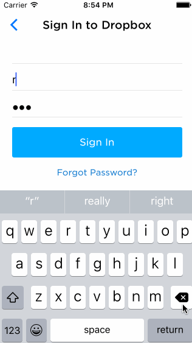

# Week-2-Carousel-app

Recreation of Carousel app that lets you tap around.

Time Spent: 12 hours

## User Stories completed:

### Intro
* [x] Static photo tiles on the initial screen
* [x] Optional: Photo tiles move with scrolling

### Sign In
* [x] Tapping on email/password reveals the keyboard and shifts the scrollview and Sign In button up.
* [x] If the username or password fields are empty, user sees an error alert.
* [x] If credentials are incorrect, user sees a loading indicator for 2 seconds followed by an error alert.
* [x] If the credentials are correct, user sees a loading indicator for 2 seconds followed by a transition to the Sign In screens.
* [x] Optional: When the keyboard is visible, if the user pulls down on the scrollview, it will dismiss the keyboard.
* [x] Optional: On appear, scale the form up and fade it in.

### Optional: Create a Dropbox
* [x] Tapping in the form reveals the keyboard and shifts the scrollview and "Create a Dropbox" button up.
* [x] Tapping the Agree to Terms checkbox selects the checkbox.
* [x] User is required to accept draconion terms of use.
* [x] Tapping on Terms shows a webview with the terms.
* [x] User is taken to the tutorial screens upon tapping the "Create a Dropbox" button.

### Tutorial Screens
* [x] User can page between the screens
* [x] Optional: User can page between the screens with updated dots
* [x] Optional: Upon reaching the 4th page, hide the dots and show the "Take Carousel for a Spin" button.

### Image Timeline
* [x] Display a scrollable view of images.
* [x] User can tap on the conversations button to see the conversations screen (push).
* [x] User can tap on the profile image to see the settings view (modal from below).

### Conversations
* [x] User can dismiss the conversations screen

### Settings
* [x] User can dismiss the settings screen.
* [x] User can log out

GIF created with [LiceCap](http://www.cockos.com/licecap/).
